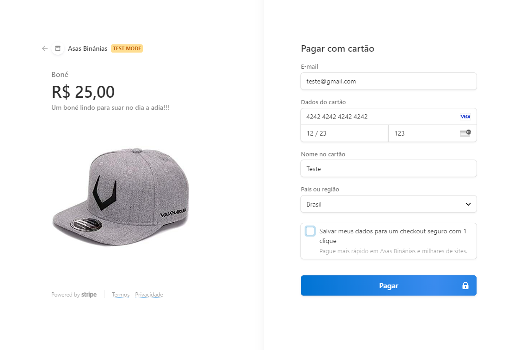

# Integração com pagamento

Projeto que faz a integração do pagamento utilizando o stripe

## Getting Started

`Instalar dependências:`

```bash
npm i
# or
yarn
```
`Rodar projeto no ambiente de desenvolvimento:`

```bash
npm run dev
# or
yarn dev
```

## Configurando a conta Stripe

Para fazer pagamentos com o stripe é preciso criar uma conta em https://stripe.com, para usar o ambiente de teste não precisa terminar o cadastro nem adicionar banco, endereço, etc.<br>

Na página inicial, copie sua chave publicável e a chave secrena e cole './config/stripe.ts'.<br>

Agora vá para a área de Produtos no menu (https://dashboard.stripe.com/test/products) e crie quantos produtos quiser.Você também vai precisar ativar a INTEGRAÇÃO COM CLIENTE na parte inferiar da página https://dashboard.stripe.com/settings/checkout. Pronto, agora voce pode rodar o projeto e fazer testes de pagamento.

## Testes de pagamento

Para saber se está no ambiente de teste vá em https://dashboard.stripe.com/settings/checkout e verifique se o Modo de teste está ativo na parte superior direita da tela.

`Para testes de pagamento utilize este cartão:`

```bash
4242 4242 4242 4242
```

`Com esse cartão de teste, todos os outros dados que é pedido na tela de compra (e-mail, data, nome no cartão, etc...) podem ser enventados.`

<div>
    
</div>

